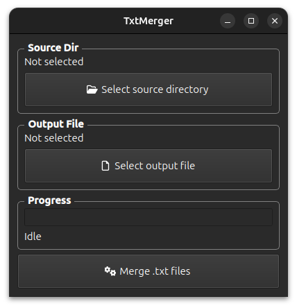
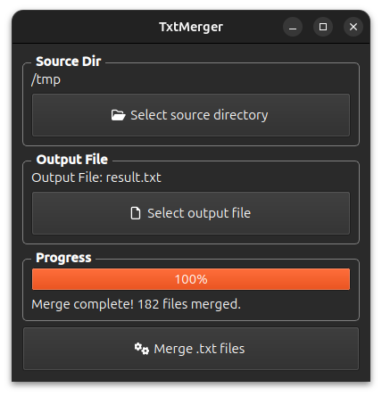

# TxtMerger

## A simple GUI tool for merging multiple .txt files into a single output file


TxtMerger is a lightweight desktop application built with PySide6 (Qt for Python) that allows users to:

* Merge multiple .txt files from a selected directory into a single output file.
* Track progress with a real-time progress bar and file counter.
* Remember previous directories thanks to persistent QSettings.
* Simple & intuitive UI with QtAwesome icons and clean styling.

&nbsp;

### 📦 Features

* File Selection – Choose a source directory and output file path via a file dialog.

* Progress Tracking – See which file is being merged and the overall progress.

* Error Handling – Handles missing directories, permission issues, and encoding errors.

* Persistent Settings – Remembers the last-used source and output directories.

* Modern UI – Uses QtAwesome for FontAwesome icons and custom stylesheets.

&nbsp;

### 🚀 Installation

* Clone the repository:

  ```bash
  git clone https://github.com/mbratanov/TxtMerger.git
  cd TxtMerger
  ```

* Install dependencies:

  ```bash
  pip install -r requirements.txt
  ```

* Run the application:

  ```bash
  python main.py
  ```

&nbsp;

### 🖥️ Usage

1. Select a source directory containing .txt files.</li>

2. Choose an output file where the merged content will be saved.</li>

3. Click "Merge .txt files" to combine all .txt files into one.</li>
   &nbsp;

 

&nbsp;

### 🛠️ Technical Details

* Backend:
    * FileMerger class handles file operations (merging, encoding checks).</li>
    * AppSettings uses QSettings to store user preferences.</li>

* Frontend:
    * MainWindow provides a clean Qt interface with grouped sections.</li>
    * Progress updates via signals and QProgressBar.</li>

&nbsp;

### 📜 License

MIT
